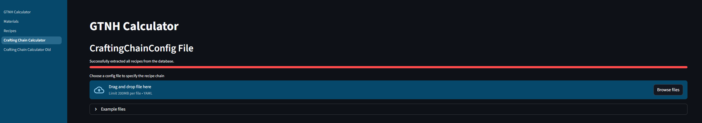
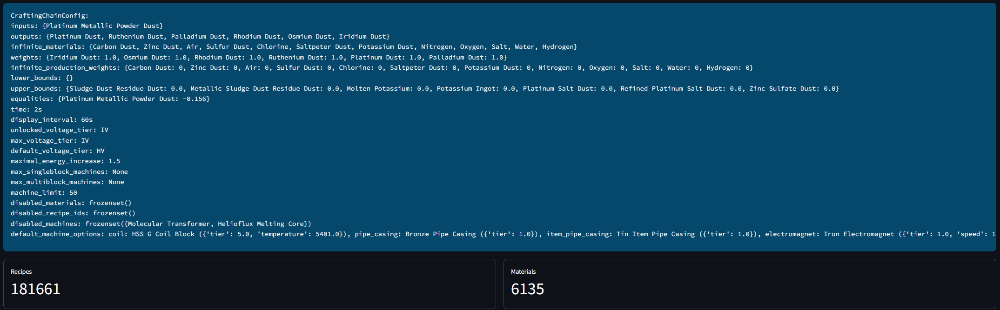
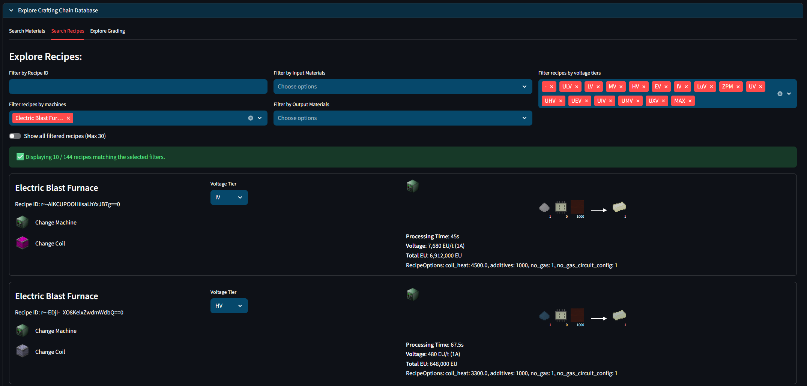
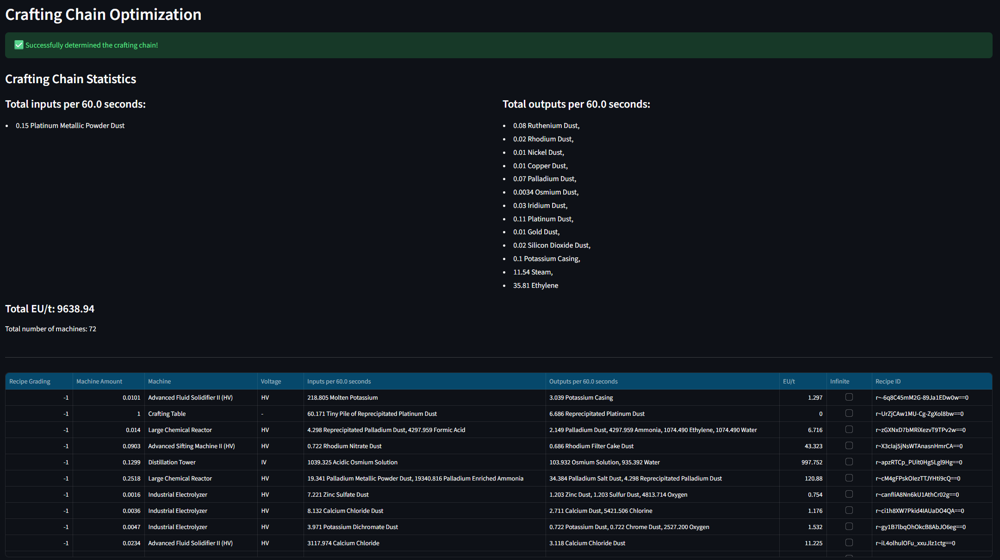

# GTNH Calculator

GTNH Calculator is a Python-based tool for exploring, optimizing and analyzing production chains in the modded Minecraft ecosystem of GregTech: New Horizons (GTNH, version 2.8.0).

The repository includes a recipe database loader and a Streamlit dashboard for interactive visualization of materials, recipes and machines. The project extracts and models the complete in-game production network using data generated by the [NESQL Exporter](https://github.com/ShadowTheAge/nesql-exporter). It provides tooling for recipe exploration, dependency analysis, and mathematically optimal production chain generation.

**Live Web-App:** https://gtnhcalculator.streamlit.app/

> Note: The project is currently under active development.


## Key Features

- Modeling of large-scale production networks with more than 200,000 recipes stored in a SQLite database.
- Interactive exploration of recipes, machines, and materials through a web interface.
- Accurate simulation of machine-specific behavior, including voltage tiers, coils, pipe casings, and other configuration-dependent modifiers.
- YAML-based configuration system for defining production objectives and constraints.
- Automatic generation of mathematically optimal production chains using the [HiGHS](https://highs.dev/) linear optimization solver for sparse matrices.


## Overview

The optimizer models production chains as a large-scale constrained optimization problem. Users can define:
- available input materials
- desired outputs
- production constraints
- optimization priorities (material weights)

The system then computes an optimal solution while minimizing resource usage and satisfying all recipe dependencies and machine constraints. Due to the size of the underlying dataset, aggregation and optimization may take up to 30 seconds depending on the hardware and problem complexity.

### Usage

1. Upload a config file specifying all inputs, outputs and additional constraints. See below for a detailed guide on using the config file.


2. After the config selection, the app first reduces the database to only the potentially required recipes to improve computation time. When done, the inserted config file and general statistics about the reduced database are displayed.


3. Additionally, the user can explore the reduced database via the given filters.


4. The crafing chain optimization starts automatically and displays the calculated optimal crafting chain.



## Development


### Local installation

> Installation is only required for development as the [Web-App](https://gtnhcalculator.streamlit.app/) can be used at any time.

#### Requirements

- Python 3.13
- Poetry

#### Setup

1. Clone the repository:

```bash
git clone https://github.com/henrikmueller/GTNH_Calculator.git
cd GTNH_Calculator
```

2. Install dependencies with Poetry:

```bash
poetry install
```

If you want to keep the virtual environment inside the project:

```bash
poetry config virtualenvs.in-project true
```


### Repository Structure

- `src/gtnh_calculator/GTNH_Calculator.py` - Streamlit dashboard entry point
- `src/gtnh_calculator/packages/` - application packages for database extraction, recipe graphs, crafting chains, configs, and utilities
- `config/` - YAML configuration files for game state, machines, and production scenarios
- `db/` - extracted database resources and media assets used by the application
- `tests/` - unit tests for machine behaviors and other components


### Running the Streamlit App locally

Launch the GTNH Calculator dashboard from the repository root:

```bash
poetry run streamlit run ./src/gtnh_calculator/GTNH_Calculator.py
```

Run tests with:

```bash
poetry run pytest
```


## Config file for production chains

Example config files are provided in the Crafting Chain Calculator tab of the Web-App. The following options can be included:

1. Specify **input and output materials** along possible constraints.
2. The `time` variable is a string starting with an integer and ending in either 's' or 't' (for seconds or ticks). The time variable defines the amount of time, in which the output materials are to be produced.
3. Rhe `time_interval` variable needs to be formatted in the same way as the `time` variable, but has no influence on the calculation itself, only on the displayed information about the production chain at the end. All materials in this production chain are displayed in the form "x per time interval" (usually, x/tick oder x/second).
4. Associate weights to materials to prioritize some materials over others. Input materials should have negative weights, output materials should have positive weights. Per default, every material has a weight of zero.
5. Additional constraints can be specified under `restrictions`.
6. The user can also define the default machine options like coils, pipe casings, solenoid coils etc.
7. `default_voltage_tier` sets the minimal voltage tier of used recipes. If a recipe can run on the specified voltage tier, the optimizer will upgrade to this tier.
8. `unlocked_voltage_tier` defines the maximal voltage tier you want to use in the production chain. (Probably, the highest tier you have unlocked).
9. `machine_limit` sets the maximal amount of machines used in the production chain. Note that often the calculated amount will exceed the specified amount as the optimization problem is formulated as a linear, not as a mixed-integer problem to reduce the computation time to a feasible level.


## Planned features

- Multi-objective optimization to weigh production chain outputs against total energy consumption and complexity of the factory (number and size of machines)
- Pareto-front analysis for comparing alternative production strategies.
- Automatic machine parallelization and scaling for large production chains.
